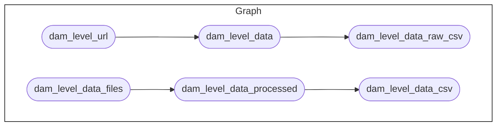

<!-- README.md is generated from README.Rmd. Please edit that file -->

# An R workflow for curation of Philippine Atmospheric, Geophysical, and Astronomical Services Administration (PAGASA) datasets

<!-- badges: start -->

<!-- badges: end -->

This repository is a
[`docker`](https://www.docker.com/get-started)-containerised,
[`{targets}`](https://docs.ropensci.org/targets/)-based,
[`{renv}`](https://rstudio.github.io/renv/articles/renv.html)-enabled
[`R`](https://cran.r-project.org/) workflow for the retrieval,
processing, and curation of various Philippine Atmospheric, Geophysical,
and Astronomical Services Administration (PAGASA) publicly available
datasets.

## Why `paglaom`?

The word `paglaom` (pronounced as */paɡˈlaʔom/, \[pʌɡˈl̪a.ʔɔm\]*) is
Bisaya (one of up to 187 languages spoken in the Philippines in addition
to Filipino, which is the national language, and English, which is the
language of instruction in the country) for hope.
[PAGASA](https://pagasa.dost.gov.ph), the national meteorological and
hydrological services agency of the Philippines, draws its name from the
Filipino word *pag-asa* which means hope. The repository name choice,
hence, is a play on these words and also a way to showcase the richness
and diversity that exists in the Pilippines.

The `paglaom` project aims to maintain a database of curated datasets on
varios atmospheric, geophysical, and astronomical phenomena that are
made publicly available by PAGASA on their website. These datasets tend
to be summaries of the multitude of data that PAGASA collects on a high
frequency basis. They also tend to be in formats that are not
machine-readable (e.g., PDF, PNG, HTML formats) meant for reporting to
the Philippine population rather than actual datasets that are usable
for academic and/or professional research. PAGASA does provide more
granular and expansive datasets for research purposes through a specific
data request process. The `paglaom` project doesn’t aim to perform
research on the summarised datasets provided publicly on the PAGASA
website. Rather, the project aims to showcase publicly avaialble data
that can be used for educational purposes some of which are:

  - for students who need to make a report on topics covered by PAGASA’s
    summarised data for a school assignment or project;

  - for individuals who have specific interest in one of the natural
    phenomena that PAGASA monitors and would like to get raw summarised
    data in a format that is usable and transferrable into other
    formats;

  - for data visualisation learners and aficionados who want to try on
    working on data about the various natural phenomena available from
    PAGASA and create unique and interesting plots and graphics.

The broader and more blue skies vision of the `paglaom` project is to
contribute to the increasing interest in science, technology,
engineering, and mathematics (STEM) subjects particularly in the
Philippines with a collection that showcases topics and data that are
homegrown and embedded into the fabric of Philippine life.

Whilst the `paglaom` project by its name and the nature of the data it
curates has an inherent Filipino audience, it is hoped that those
outside of the Philippines will also find the information within useful
in similar contexts described above.

## Repository Structure

The project repository is structured as follows:

    paglaom
        |-- .github/
        |-- data/
        |-- data-raw/
        |-- outputs/
        |-- R/
        |-- reports
        |-- renv
        |-- renv.lock
        |-- .Rprofile
        |-- packages.R
        |-- _targets_climate.R
        |-- _targets_cyclones.R
        |-- _targets_dam.R
        |-- _targets_heat.R
        |-- _targets_setup.R
        |-- _targets.R
        |-- _targets.yaml

  - `.github` contains project testing and automated deployment of
    outputs workflows via continuous integration and continuous
    deployment (CI/CD) using Github Actions.

  - `data/` contains intermediate and final data outputs produced by the
    workflow.

  - `data-raw/` contains raw datasets, usually either downloaded from
    source or added manually, that are used in the project. This
    directory is empty given that the raw datasets used in this project
    are restricted and are only distributed to eligible members of the
    project. This directory is kept here to maintain reproducibility of
    project directory structure and ensure that the workflow runs as
    expected.

  - `outputs/` contains compiled reports and figures produced by the
    workflow.

  - `R/` contains functions developed/created specifically for use in
    this workflow.

  - `reports/` contains literate code for R Markdown reports rendered in
    the workflow.

  - `renv/` contains `renv` package specific files and directories used
    by the package for maintaining R package dependencies within the
    project. The directory `renv/library`, is a library that contains
    all packages currently used by the project. This directory, and all
    files and sub-directories within it, are all generated and managed
    by the `renv` package. Users should not change/edit these manually.

  - `renv.lock` file is the `renv` lockfile which records enough
    metadata about every package used in this project that it can be
    re-installed on a new machine. This file is generated by the `renv`
    package and should not be changed/edited manually.

  - `.Rprofile` file is a project R profile generated when initiating
    `renv` for the first time. This file is run automatically every time
    R is run within this project, and `renv` uses it to configure the R
    session to use the `renv` project library.

  - `packages.R` file lists out all R package dependencies required by
    the workflow.

  - `_targets*.R` files define the steps in the workflow’s data ingest,
    data processing, data analysis, and reporting pipelines.

  - `_targets.yaml` file defines the different targets sub-projects
    within this project.

## The workflow

Currently, the project curates the following datasets:

1.  Tropical cyclones data for various cyclones entering the Philippine
    area of responsibility since 2017;

<!-- end list -->

2.  Daily heat index data from various data collection points in the
    Philippines;

<!-- end list -->

3.  Climatological extremes and normals data over time; and,

<!-- end list -->

4.  Daily dam water level data.

<!-- end list -->

## Reproducibility

### R package dependencies

This project was built using `R 4.4.1`. This project uses the `renv`
framework to record R package dependencies and versions. Packages and
versions used are recorded in `renv.lock` and code used to manage
dependencies is in `renv/` and other files in the root project
directory. On starting an R session in the working directory, run
`renv::restore()` to install R package dependencies.
